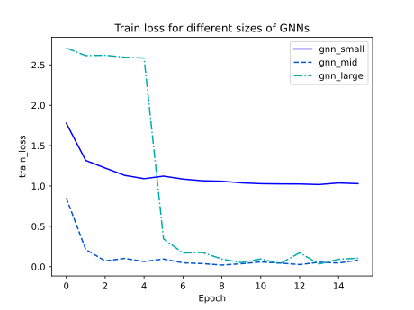

## Results and Comparative Analysis

In our analysis, we compared the performances of MLPs, Transformers, and GNNs using our generated dataset. Initially, we evaluated the performance of each architecture across different sizes by recording in-sample and out-of-sample losses at each epoch, along with out-of-sample accuracy. We compared three model sizes: "small," "mid," and "large," which correspond to the depth of the model. For GNNs, this signifies the number of iterations; for Transformers and MLPs, it refers to the number of layers. Small models have 2 iterations/layers, mid models 5, and large models 10. 

To maintain fair comparisons, the MLP and the Transformer were designed to have an equal total number of trainable parameters at each size. We excluded GNNs from this comparison, as they outperformed both models with significantly fewer parameters.

### GNN performance

Our GNNs demonstrated exceptional performance on the shortest path task. Tailoring the model's architecture to this problem (using maximum aggregation and initializing node features appropriately) likely contributed to this success. However, several interesting observations emerged from our results. We compared GNNs of three different sizes: small (2 iterations, 13k parameters), medium (5 iterations, 32k parameters), and large (10 iterations, 64k parameters).

    

    

    GNN Training loss, validation loss & validation accuracy for different sizes

We observed that both medium and large GNNs achieved over 99% out-of-sample accuracy after just a few epochs. The large model's performance aligns with expectations, as it conducts 10 iterations in total—matching the maximum number of iterations required by standard shortest-path-finding algorithms like Bellman-Ford for n-node graphs. 

Surprisingly, the medium-sized model, with only 5 iterations, also achieved similar accuracy. This initially seems counterintuitive since 5 iterations suggest that information can only propagate to nodes within 5 neighbors. However, as noted in <d-cite key="DBLP:journals/corr/abs-1905-13211"></d-cite>, our GNN effectively learns an optimized version of the Bellman-Ford algorithm, requiring only half the number of iterations compared to the standard algorithm. 

This explains why the medium GNN can converge efficiently, but the small model with just 2 iterations cannot. Even with an optimized Bellman-Ford algorithm, a 2-iteration GNN would only correctly solve paths shorter than or equal to 5 nodes, limiting its overall learning capacity.

### MLP performance

Although GNNs quickly converged to near-perfect predictions, their inherent suitability for the shortest path task was expected. To gauge the Transformers' performance more accurately, we compared them with MLPs, which are not specifically designed for this task. As indicated in <d-cite key="DBLP:journals/corr/abs-1905-13211"></d-cite>, MLPs struggle with iterative algorithms like Bellman-Ford due to difficulties in learning for-loop structures. We analyzed MLP performance across three sizes: small (2 layers, 44k parameters), medium (4 layers, 76k parameters), and large (8 layers, 142k parameters). It's important to note that each GNN size had roughly half the parameters of the corresponding MLP size.

    {% include figure.html path="assets/img/2023-11-08-graphs-transformers/comparative_plots/mlp_train_loss.svg" style="width: 100%; height: auto;" class="img-fluid rounded z-depth-1" %}

    {% include figure.html path="assets/img/2023-11-08-graphs-transformers/comparative_plots/mlp_val_loss.svg" style="width: 100%; height: auto;" class="img-fluid rounded z-depth-1" %}

    {% include figure.html path="assets/img/2023-11-08-graphs-transformers/comparative_plots/mlp_val_acc.svg" style="width: 100%; height: auto;" class="img-fluid rounded z-depth-1" %}

    MLP Training loss, validation loss & validation accuracy for different sizes

The smaller MLP models converged faster, yet both small and medium models barely exceeded 50% accuracy, even after extensive training (16 epochs for GNNs and 64 for MLPs). This supports the hypothesis that MLPs face challenges in learning iterative algorithms. 

Increasing model size or training duration did not significantly improve performance; the largest model struggled particularly with fitting the problem. While more hyperparameter tuning might enhance the "large" model's performance, the "medium" model's struggles suggest that MLPs have inherent difficulties with this task, regardless of parameter count.

### Transformer performance

Turning our attention to Transformers, we initially doubted their ability to match GNN performance levels. However, the question remained: could they outperform MLPs, and if yes by how much? We began by testing a basic Transformer version (no attention mask, positional encoding, or skip connection). To ensure fair comparisons, all model sizes maintained approximately the same number of parameters as the MLPs, with equivalent layers/iterations (small: 2 layers, 44k parameters; medium: 5 layers, 86k parameters; large: 10 layers, 172k parameters).

    {% include figure.html path="assets/img/2023-11-08-graphs-transformers/comparative_plots/transformer_train_loss.svg" style="width: 100%; height: auto;" class="img-fluid rounded z-depth-1" %}

    {% include figure.html path="assets/img/2023-11-08-graphs-transformers/comparative_plots/transformer_val_loss.svg" style="width: 100%; height: auto;" class="img-fluid rounded z-depth-1" %}

    {% include figure.html path="assets/img/2023-11-08-graphs-transformers/comparative_plots/transformer_val_acc.svg" style="width: 100%; height: auto;" class="img-fluid rounded z-depth-1" %}

    Transformer training loss, validation loss & validation accuracy for different sizes

A notable improvement in accuracy was observed, with the best-performing Transformer model reaching 70% accuracy. The training was stopped at 64 epochs to maintain consistency across all models. As it does not show signs of overfitting, extending training beyond 64 epochs might further enhance the Transformer's performance. Interestingly, increasing the model size to over 150k parameters did not significantly boost performance under our hyperparameter settings. The small and medium architectures exhibited similar performance, with the medium model slightly outperforming after a few epochs.

Regarding sizes, similarly to the MLP, increasing the depth and parameter count of the transformer over 150k parameters doesn't seem to help with the model's performance, at least with our set of hyperparameters (as this big of a transformer is long to train, we haven't been able to do much hyperparameter tuning). The small and medium architectures seem almost tied, but the medium one seems to perform better after a few epochs. 

Our hypothesis in Part 1 suggested that Transformers, capable of performing $O(n^2)$ operations per attention head, should learn loop structures more effectively. However, their learning is constrained by the specific operations allowed in the attention mechanism. To test this, we proposed three enhancements to our Transformer: an attention mask, positional encoding, and a skip connection, as outlined in Part 1 and Appendix A. We hypothesized that these additions would enable the Transformer to better learn the Bellman-Ford iteration step.
 
### Transformer with Attention Mask, Positional Encoding & Skip Connection
 
As discussed in Part 1, we adapted our Transformer model to include these three components, expecting an improvement in performance. The attention mask, a fundamental feature of Transformers, enables the model to focus on specific token relationships. In our setup, each token (node) attends only to its neighbors, as dictated by the adjacency matrix. We incorporated the attention mask into the medium-sized Transformer for comparison.

Next, we added positional encoding. Based on our Part 1 discussion, positional encodings can inform the feedforward network (FFN) about the neighboring tokens selected by the attention layer. We used basic one-hot encodings, effectively adding an $n×n$ identity matrix or concatenating an $n×1$ one-hot vector to each token. Although more sophisticated encodings might be beneficial, we demonstrated the feasibility of using one-hot encodings for the Bellman-Ford update.

Finally, we implemented a custom skip connection. Instead of a standard sum skip connection, our model concatenates the input and output of the attention head before feeding it into the FFN. This approach potentially allows the attention head to select a neighbor, with the FFN combining its token with the receiving node's token.

We added each augmentation stepwise, building upon the previous modifications (e.g., transformer_pos_enc includes positional encoding, attention mask, and is medium-sized). Here are the results:

    {% include figure.html path="assets/img/2023-11-08-graphs-transformers/comparative_plots/transformer_train_loss_all.svg" style="width: 100%; height: auto;" class="img-fluid rounded z-depth-1" %}

    {% include figure.html path="assets/img/2023-11-08-graphs-transformers/comparative_plots/transformer_val_loss_all.svg" style="width: 100%; height: auto;" class="img-fluid rounded z-depth-1" %}

    {% include figure.html path="assets/img/2023-11-08-graphs-transformers/comparative_plots/transformer_val_acc_all.svg" style="width: 100%; height: auto;" class="img-fluid rounded z-depth-1" %}

    Transformer training loss, validation loss & validation accuracy for different sizes

Each augmentation step led to clear improvements. Over 64 epochs, our base model's out-of-sample accuracy improved from 70% to over 90%. The positional encoding contributed the most significant enhancement, which was somewhat surprising given its simplicity. Overall, these results support our hypothesis regarding the Transformer's capacity to learn the Bellman-Ford iteration step.

## Conclusion

In this project, we compared MLPs, Transformers, and GNNs in solving graph-related problems, with a focus on the shortest path in Erdos-Renyi graphs. Our findings indicate GNNs excel in such tasks due to their specialized architecture. However, the adaptability of Transformers, particularly with architectural modifications like attention masks, positional encodings, and skip connections, is a significant discovery. While these models showed promise, larger MLP and Transformer models faced convergence issues, highlighting the need for better hyperparameter optimization in future work.

Transformers’ theoretical success in approximating the Bellman-Ford algorithm, verified by empirical results, suggests potential in a subset of dynamic programming (DP) problems where DP updates are simple and manageable by attention heads. However, their capability is inherently limited compared to the theoretically more versatile GNNs, due to the softmax and linear combination constraints in attention mechanisms. Future work could delve into designing Transformer models with enhanced attention mechanisms, potentially broadening their applicability in complex DP problems. Investigating the synergy between Transformers and GNNs could also lead to innovative hybrid models.

Overall, our exploration sheds light on the potential of Transformers in graph-related tasks, suggesting they could offer valuable insights and solutions, alongside the more established GNNs. This finding could open up interesting possibilities for research and innovation in neural network applications, particularly in solving complex graph-related challenges.

(1) https://arxiv.org/pdf/2106.05234.pdf
Do Transformers Really Perform Bad

(2) https://arxiv.org/pdf/1905.12712.pdf
Path-Augmented Graph Transformer Network

Things to test:
- Trying shortest path / coloring number
- Trying MLP, GNN, Transformers
- Attn mask (adjacency matrix)
- Adding T_{in} connections
- Changing number of GNN iterations/Transformer's attention layers (not nb. of heads)
- Positional encoding / not
- Make epochs checkpoints (16, 32, 48?)

Dataset:
- Remove duplicate adjacency matrix?
- Balance shortest path (or chromatic nb)
